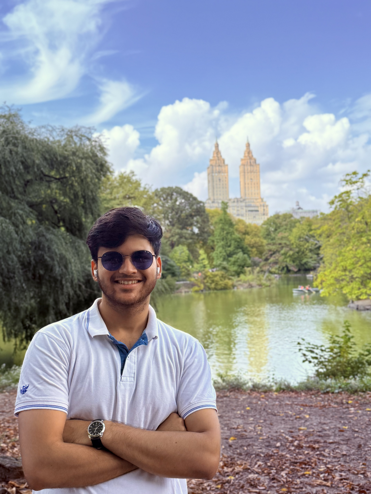

Hi! Welcome to my corner of the Internet 🌐.

I'm Kushal, and I’m currently part of the AI engineering team at [Biopeak Health 🧬](https://biopeak.com/) which is building the next-generation of healthcare. I enjoy puzzles 🧩, and consider myself a lifelong learner with a passion for building (and breaking and re-building) 🛠️ things that make life easier. In an era of vibe-coders armed by ChatGPT and Claude, I enjoy writing code myself 👨🏻‍💻 and am always ready to dive in whenever I see a big, red `error`.

## Work

Most days, you’ll find me somewhere between a vector database and a whiteboard 🖊.

I help create AI solutions that help doctors and health coaches—by making data clearer, more reliable systems, and easier to act on insights. That means stitching together everything from backend pipelines and retrieval systems to frontend interfaces that are simple, fast, and intuitive.

I design with care for edge cases (even the invisible ones); and spend a lot of time thinking about how to make sure our tools don’t just work, but work when it matters most (and in healthcare, that's all the time)!

The goal is to help build a future where healthcare is proactive, personalised, and designed around the individual. And to do that, I go wherever the problem takes me -- whether it’s databases, design docs, or debugging something at 11:57pm ⏳.

## Education

I completed my Bachelors in Computer Science 🎓 from [BITS Pilani, Hyderabad](https://www.bits-pilani.ac.in/hyderabad/) where I spent 4 wonderful years and made some amazing friends.

Academically, I wasn’t a topper, but I was always curious and willing to get my hands dirty. I explored blockchain research, built side projects that broke more often than they worked, and wrote just enough papers 📝 to pretend I understood what I was doing. Looking back, college wasn’t just about lectures—it was about learning how to learn, and that’s a skill I carry with me everywhere.

## Interests

When I’m not buried in code or debugging logs, you’ll probably find me swimming 🏊🏻‍♂️,&nbsp; lost in a good book 📖, &nbsp;watching cricket 🏏,&nbsp; or staring out the window with my headphones on 🎧 and brain turned off.

This site is a collection of my work, my interests, and the journey in between. Thanks for stopping by—feel free to reach out, collaborate, or just say hi!

## Contact

- LinkedIn: [/in/kushal-mishra](https://www.linkedin.com/in/kushal-mishra/)
- Email: work[dot]kushalmishra[at]gmail[dot]com
